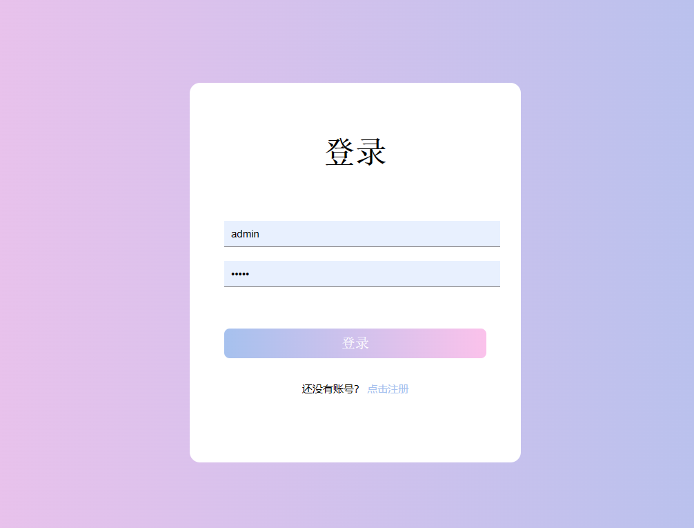
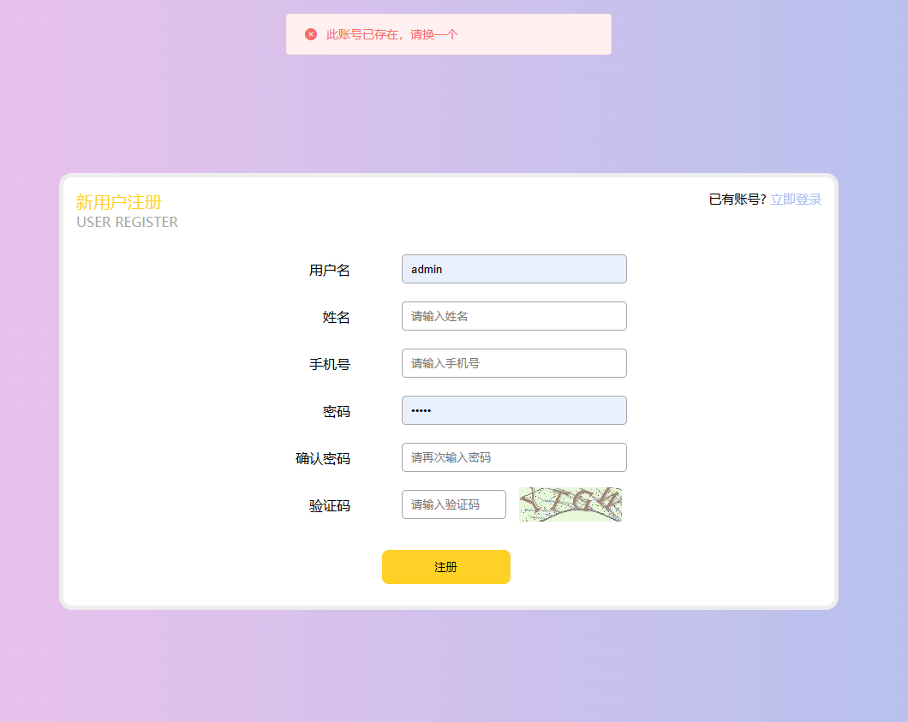
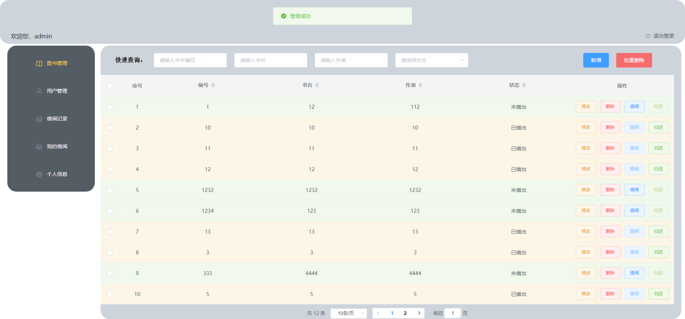

# library_infomation

#### 介绍
javaee课程作业-图书馆信息管理系统，后端使用springboot+springsecurity+mybatis-plus+mysql，前端使用vue2+elementUI，使用token做验证

#### 软件架构
后端使用springboot+springsecurity+mybatis-plus+mysql，前端使用vue2+elementUI，使用token做验证


#### 使用说明
1. 创建数据库，导入数据库文件

2. 将项目添加到ide，安装相应的依赖，启动springboot启动类

3. 配置前端服务器，进入lib_client目录，打开cmd

   ```
   npm install
   npm run serve
   ```

4. 管理员账户：admin，密码：1234

   普通账户：user，密码：1234

部分页面截图如下：




